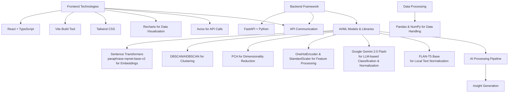

# AI POC Technology Stack Flowchart

```mermaid
flowchart TD
    A[Frontend Technologies] --> A1[React + TypeScript]
    A --> A2[Vite Build Tool]
    A --> A3[Tailwind CSS]
    A --> A4[Recharts for Data Visualization]
    A --> A5[Axios for API Calls]

    B[Backend Framework] --> B1[FastAPI + Python]

    C[AI/ML Models & Libraries] --> C1[Sentence Transformers<br/>paraphrase-mpnet-base-v2 for Embeddings]
    C --> C2[DBSCAN/HDBSCAN for Clustering]
    C --> C3[PCA for Dimensionality Reduction]
    C --> C4[OneHotEncoder & StandardScaler for Feature Processing]
    C --> C5[Google Gemini 2.0 Flash<br/>for LLM-based Classification & Normalization]
    C --> C6[FLAN-T5 Base<br/>for Local Text Normalization]

    D[Data Processing] --> D1[Pandas & NumPy for Data Handling]

    A --> F[API Communication]
    B --> F
    B --> C
    C --> G[AI Processing Pipeline]
    G --> H[Insight Generation]
```